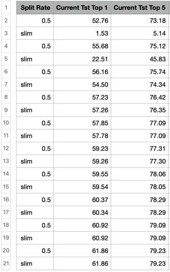

# knowledge_evolution
PyTorch implementation of the Knowledge Evolution training approach and Split-Nets

### TL;DR
We subclass neural layers and define the mask inside the subclass. When creating a new network, we simply use our SplitConv and SplitLinear instead of the standard nn.Conv2d and nn.Linear.

## Requirements

* Python 3+ [Tested on 3.7]
* PyTorch 1.X [Tested on torch 1.6.0 and torchvision 0.6.0]

[//]: # "## ImageNet Pretrained Models"

## Usage example

The Flower102Pytorch loader (`data>flower.py`) works directly with this [Flower102 dataset](https://drive.google.com/file/d/1ftEUxDIS_VOcx_OO70QDfZvHNDxXXgRY/view?usp=sharing). This is the original flower102, but with an extra `list` directory that contains csv files for trn, val and tst splits. Feel free to download the flower dataset from [oxford website](https://www.robots.ox.ac.uk/~vgg/data/flowers/102/), just update `data>flower.py` accordingly. 

The following table shows knowledge evolution in both the dense (even rows) and slim (odd rows) using Flower102 on ResNet18.
As the number of generation increases, both the dense and slim networks' performance increases.

  

### TODO LIST
* Disable CS_KD
* Document the important flags
* Add sample results to README file
* Add GoogleNet support

Contributor list
----------------
1. [Ahmed Taha](http://www.cs.umd.edu/~ahmdtaha/)

I want to give credit to [Vivek Ramanujan and Mitchell Wortsman's repos](https://github.com/allenai/hidden-networks). My implementation uses a lot of utils and functions from their code

### Further Contributions
1. It would be great if someone re-implement this in Tensorflow. Let me know and I will add a link to your Tensorflow implementation here
2. Pull requests to support more architectures (e.g., WideResNet, MobileNet, etc) are welcomed.
3. I accepts tips to improve the code quality.
4. To the contribution list, I will add the names/links of those who contribute to this repository.

### MISC Notes
* This repository delivers a knowledge evolution implementation in a _**minimal**_ form. Accordingly, I disabled CS_KD baseline because it requires a specific sampling implementation. 
* Our implementation might looks complex because it supports concatenation layers in DenseNet and GoogLeNet. For those interested in ResNets only, please use algorithm #1 presented in the paper.

## Release History
* 1.0.0
    * First code commit on 10 Dec 2020
    * Submit/Test Split_googlenet code commit on 19 Dec 2020
    * Submit/Test Split_densenet code commit on 20 Dec 2020
